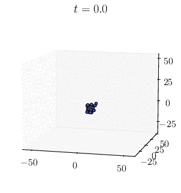
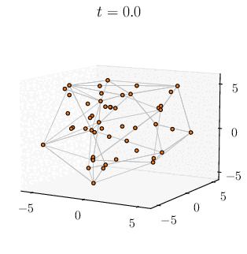
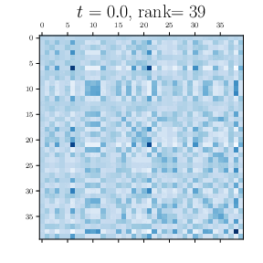

<!-- Title -->
<h1 align="center">
  The emergence of clusters in self-attention dynamics
</h1>

<p align="center">
  <a href="https://arxiv.org/abs/2305.05465">
  
  </a>
</p>

<tt>Python</tt> codes for the paper 
*The emergence of clusters in self-attention dynamics* by Borjan Geshkovski, Cyril Letrouit, Yury Polyanskiy, and Philippe Rigollet. 

<p align="center">
  
  
  
</p>

## Abstract

*Viewing Transformers as interacting particle systems, we describe the geometry of learned representations when the weights are not time-dependent. We show that particles, representing tokens, tend to cluster toward particular limiting objects as time tends to infinity. Using techniques from dynamical systems and partial differential equations, we show that type of limiting object that emerges depends on the spectrum of the value matrix. Additionally, in the one-dimensional case we prove that the self-attention matrix converges to a low-rank Boolean matrix. The combination of these results mathematically confirms the empirical observation made by Vaswani et al. that leaders appear in a sequence of tokens when processed by Transformers.*

## Citing

```bibtex
@article{geshkovski2023emergence,
      title={The emergence of clusters in self-attention dynamics}, 
      author={Borjan Geshkovski and Cyril Letrouit and Yury Polyanskiy and Philippe Rigollet},
      year={2023},
      eprint={2305.05465},
      archivePrefix={arXiv},
      primaryClass={cs.LG}
}
```
